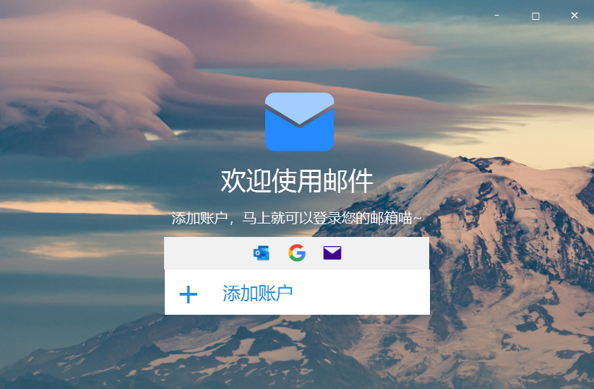

## Simple Mail Client with SMTP/POP3

### 项目简介

一个使用java开发的邮件客户端，可以通过SMTP协议和POP3协议实现邮件的收发，以及简单的用户登录功能。

项目的UI如下所示（模仿的Windows Mail客户端UI）：

### 安装教程

运行项目，需要先拥有以下依赖：

1. java.mail类库，项目lib中有，用以获取SMTP以及POP3 API
2. javaFX，项目UI依赖于JavaFX
3. java1.8，项目使用java8进行开发，其他java版本暂时未做测试，请知悉。

### 使用说明

项目并未使用maven等构建工具进行构建，是javaFX原生项目，因为是学习时写的简单工具，所以并没有很高的拓展性。

### 最后

如果感到有帮助欢迎star喵，点个star谢谢喵~

